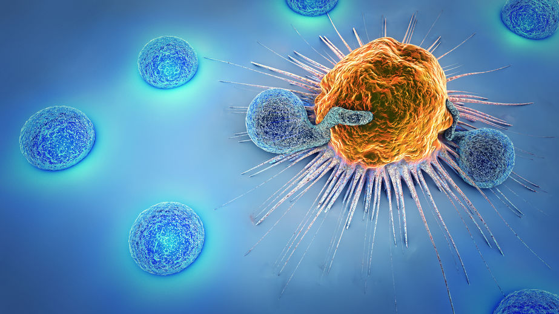
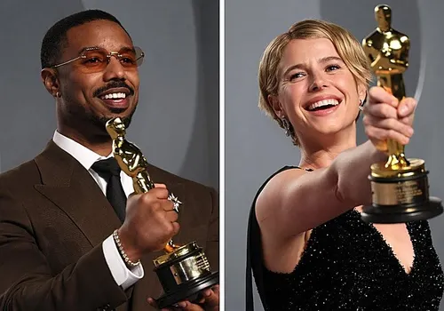
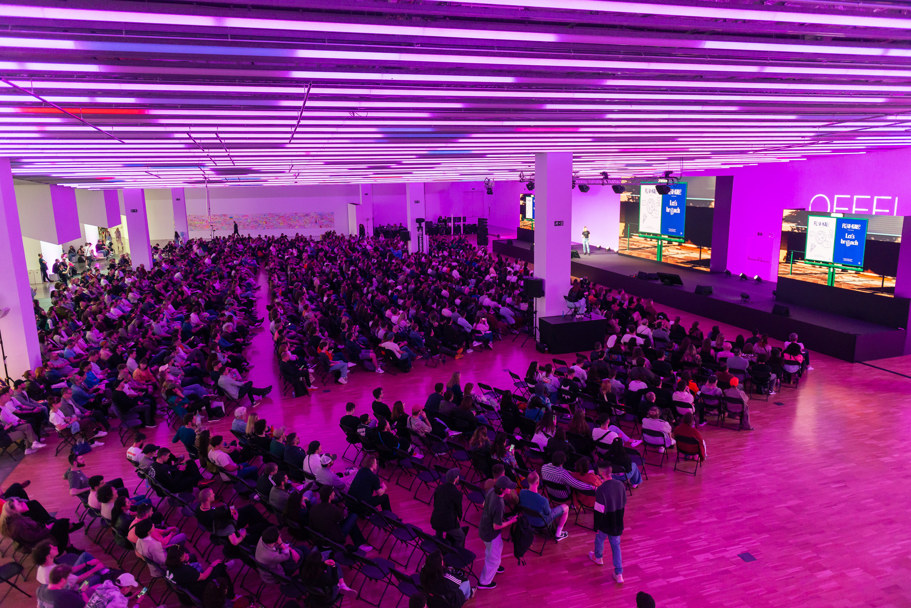
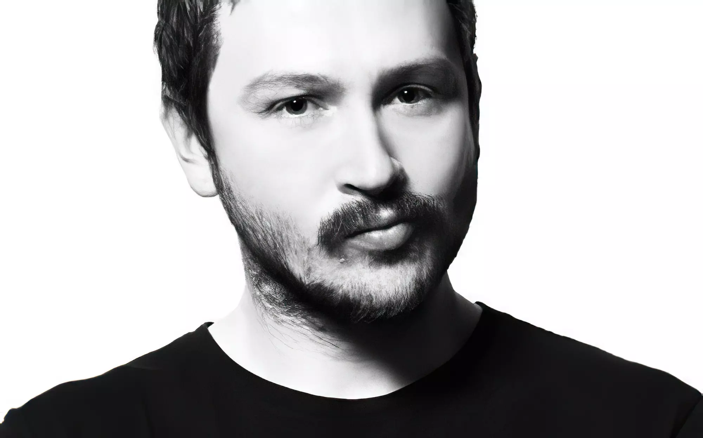
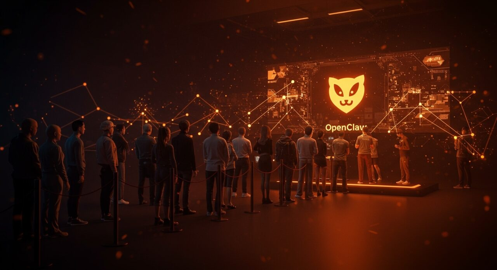
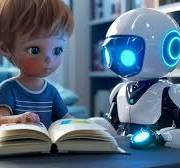

# Básicos de Github

  

---

Repositorio de práctica para aprender a trabajar en equipo con Git y GitHub.

Este ejercicio NO busca programar.
Busca entender el flujo real de trabajo colaborativo:

- clonar un repositorio
- crear ramas
- editar un archivo compartido
- hacer commit
- hacer push
- abrir un Pull Request
- revisar cambios
- hacer merge final

En [instrucciones](instrucciones.md) está el detalle.

---

## Secciones a completar

<!-- INICIO SECCIÓN DEPORTE -->
### 1. Deporte

<!-- FIN SECCIÓN DEPORTE -->

<!-- INICIO SECCIÓN POLÍTICA -->
### 2. Política

<!-- FIN SECCIÓN POLÍTICA -->

<!-- INICIO SECCIÓN NATURALEZA -->
### 3. Naturaleza

<!-- FIN SECCIÓN NATURALEZA -->

<!-- INICIO SECCIÓN MEDICINA -->
### 4. Medicina
La oncología médica es la especialidad centrada en el diagnóstico, tratamiento sistémico (quimioterapia, inmunoterapia, terapias dirigidas) y seguimiento integral del paciente con cáncer. Su objetivo es curar, controlar la enfermedad o mejorar la calidad de vida mediante cuidados paliativos, trabajando en equipos multidisciplinarios. 

Aspectos Clave de la Medicina Oncológica:

•    Diagnóstico y Estadificación: Los oncólogos realizan biopsias, estudios genéticos y pruebas de imagen para identificar el tipo y alcance del tumor.

•    Tratamientos Sistémicos: Se especializan en terapias que actúan en todo el organismo, tales como:

o    Quimioterapia: Fármacos para destruir células cancerosas.
[link al url](https://elpais.com/salud-y-bienestar/2025-10-25/los-misiles-teledirigidos-a-las-celulas-tumorales-abren-una-nueva-autopista-para-plantar-cara-al-cancer.html)

[link al url](https://www.bcrf.org/blog/the-science-behind-hope-5-breakthrough-areas-in-breast-cancer-research-from-2025/)

o    Terapia dirigida: Medicamentos que atacan alteraciones moleculares específicas del tumor.
[link al url](https://www.cancertodaymag.org/winter-2025-2026/targeted-therapy-combination-provides-deep-remissions/)

[link al url](https://pmc.ncbi.nlm.nih.gov/articles/PMC12975599/)

o    Inmunoterapia: Estimula el sistema inmunitario del paciente.
[link al url](https://link.springer.com/article/10.1007/s44178-025-00205-0)

[link al url](https://pmc.ncbi.nlm.nih.gov/articles/PMC12855455/)

<!-- FIN SECCIÓN MEDICINA -->

<!-- INICIO SECCIÓN CINE -->
### 5. Cine

Facebook
X
Bluesky
WhatsApp
Copiar enlace
La 98ª edición de los Premios Oscar ha vuelto a reunir esta noche en el Dolby Theatre, en Los Ángeles, a las grandes figuras de la industria cinematográfica para celebrar lo mejor del último año en el cine. Los pecadores, con 16 nominaciones, y Una batalla tras otra, con 13, parten como favoritas.

La ceremonia, organizada por la Academy of Motion Picture Arts and Sciences entrega las estatuillas más prestigiosas del séptimo arte, reconociendo el trabajo de intérpretes, directores, técnicos y creadores de todo el mundo. A continuación, repasamos la lista completa de ganadores de esta edición:

OSCAR 2026, TODOS LOS GANADORES POR CATEGORÍA
MEJOR PELÍCULA
Una batalla tras otra - GANADOR
Bugonia
Frankenstein
Hamnet
Marty Supreme
El agente secreto
Valor sentimental
Los pecadores
Sueños de trenes
F1: La película

Más info en: [Enlace_noticia](https://www.rtve.es/noticias/20260316/ganadores-oscar-2026-lista-completa/16981745.shtml)

  

<!-- FIN SECCIÓN CINE -->

<!-- INICIO SECCIÓN ARTE -->
### 6. Arte
mirar pagina web [aqui:](https://www.offf.barcelona/offf-schedule)
OFFF Barcelona hosts innovative and emerging talents to share their insightful experiences.

Community of creatives, designers, thinkers, sound designers, graphic designers, students, theorists, developers, and professionals. The largest showcase and meeting point for contemporary visual creativity, where the best talents share their creative processes and explore the future of the global creative industry.

  

Onur Senturk is a director and artist based in London. His early education in traditional fine arts was followed by a degree in animation from college. He gained recognition with his abstract short films Nokta and Triangle. Afterwards, he began working at Prologue Films, contributing to feature films through design and animation. His design and art direction on the main titles of David Fincher’s The Girl with the Dragon Tattoo helped launch his directing career.

  

Linia ывапролджлорпавкенгшщз

<!-- FIN SECCIÓN ARTE -->

<!-- INICIO SECCIÓN TECNOLOGÍA -->
### 7. Tecnología

## Qué es OpenClaw y por qué importa ahora mismo

  

OpenClaw —anteriormente conocido como Clawdbot y Moltbot— es un agente de inteligencia artificial autónomo, gratuito y de código abierto desarrollado por el programador austriaco Peter Steinberger. A diferencia de un chatbot convencional, OpenClaw no se limita a responder preguntas: ejecuta tareas complejas directamente en el hardware del usuario, se integra con aplicaciones como WeChat, WhatsApp o Telegram, y puede conectarse a modelos de lenguaje como Claude o GPT para operar con autonomía real.

En menos de 100 días desde su lanzamiento masivo, OpenClaw se ha convertido en uno de los fenómenos de IA agéntica más explosivos de 2026. Y el epicentro de esa explosión no está en Silicon Valley: está en China.

La escena que lo dice todo: colas en Shenzhen

El 9 de marzo de 2026, cerca de 1.000 personas se congregaron físicamente frente a la sede de Tencent Holdings en Shenzhen. No era el lanzamiento de un smartphone ni una oferta laboral. Era una invitación abierta de la división de nube de Tencent para que ingenieros de la empresa instalaran OpenClaw de forma completamente gratuita en los ordenadores de quienes acudieran.

Para completar la info. Sigue el enlace: [Enlace_noticias](https://ecosistemastartup.com/openclaw-arrasa-en-china-colas-en-tencent-por-el-agente-ia/)

<!-- FIN SECCIÓN TECNOLOGÍA -->

<!-- INICIO SECCIÓN EDUCACIÓN -->
### 8. Educación
#### La inteligencia artificial en la educación
La Inteligencia Artificial (IA) proporciona el potencial necesario para abordar algunos de los desafíos mayores de la educación actual, innovar las prácticas de enseñanza y aprendizaje y acelerar el progreso para la consecución del ODS 4. Sin embargo, los rápidos desarrollos tecnológicos conllevan inevitablemente múltiples riesgos y desafíos, que hasta ahora han superado los debates políticos y los marcos regulatorios. La UNESCO se compromete a apoyar a los Estados Miembros para que saquen provecho del potencial de las tecnologías de la IA con miras a la consecución la Agenda de Educación 2030, al tiempo que vela por que su aplicación en contextos educativos responda a los principios básicos de inclusión y equidad.

Lee el artículo completo [aquí:](https://www.unesco.org/es/digital-education/artificial-intelligence)

  

<!-- FIN SECCIÓN EDUCACIÓN -->

<!-- INICIO SECCIÓN ECONOMÍA -->
### 9. Economía

<!-- FIN SECCIÓN ECONOMÍA -->

<!-- INICIO SECCIÓN VIAJES -->
### 10. Viajes

<!-- FIN SECCIÓN VIAJES -->

[Ir a instrucciones](instrucciones.md)